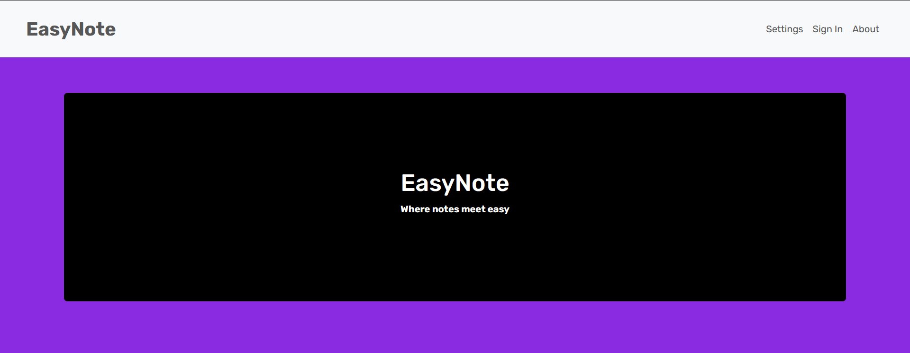
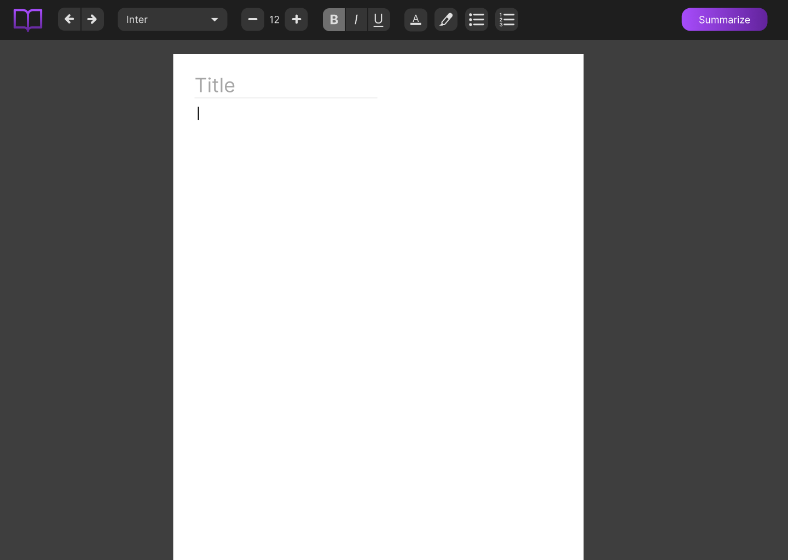

# EasyNote
This note-taking web application made for students integrates an AI Natural Language Processing (NLP) library, allowing users to generate concise summaries of their notes to any length. We created this as our final project for UCI's Informatics 133 course (User Interaction Software).



## Features
Our note-taking page currently allows users to type out notes and customize selected text by
* Applying bold, italics, and underline
* Changing text color with 31 different colors
* Highlighting text with 27 different colors

Users can also press the "Summarize" button to begin generating a summary of their notes. A pop-up allows them to specify which text to summarize (selected, all, or pasted text) as well as how long the summary should be.

You can view the UI concept and different iterations of our note-taking page in our [Figma design](https://www.figma.com/design/XxjCzTXABP9ZLaNTZZjecB/INF-133-Note-taking-web-app?t=qD7uc5vnguERKNgj-1).



## How to Use
To launch the application:
1. Clone this repository.
2. Install dependencies:
    - Flask
    - Flask-SQLAlchemy
    - Flask-Bcrypt
    - Flask-JWT-Extended
    - bert-extractive-summarizer, which we're using for AI text summarization. This can installed with ```pip install bert-extractive-summarizer```. You might also need to install:
        - PyTorch
        - transformers
        - numpy
3. Run "server.py". The first time you run the server, it may take some time as the BERT model is being downloaded and loaded into memory.
4. When you see the localhost IP address (127.0.0.1:5000), click the IP address or type "127.0.0.1:5000".
5. Click Login and then Register to create a new account. User credentials are stored in a local SQLite database file (users.db).

